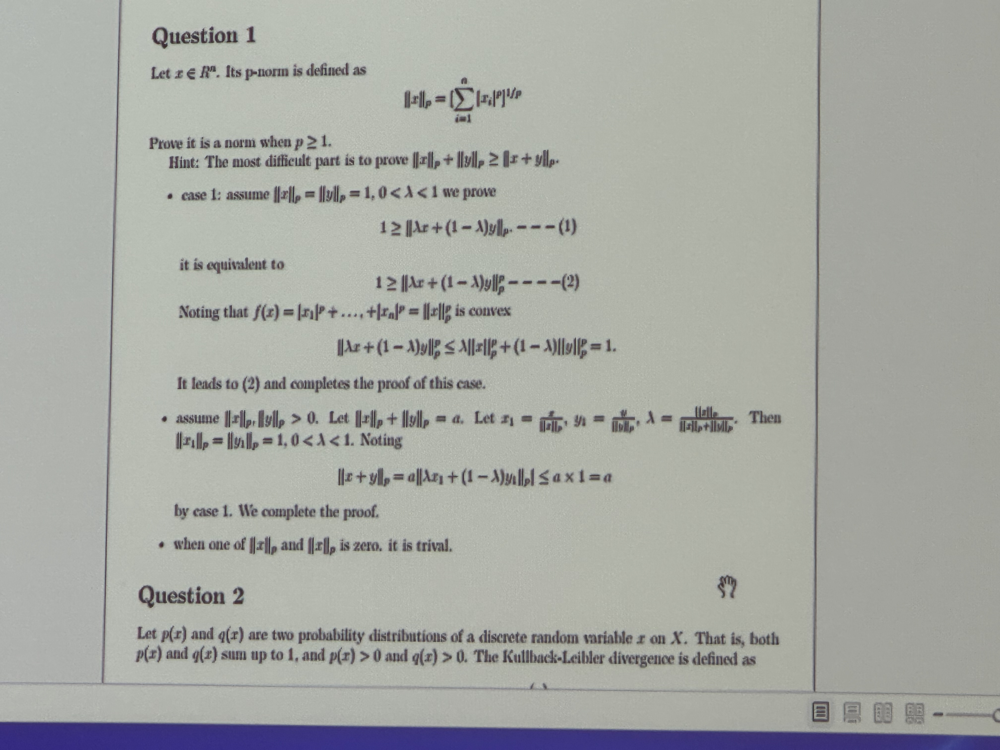

## 1. Stop at "Second-order conditions" (8/44 in lecture 3+4)
### Key words:
- directional derivative 方向导数
- Hessian matrix 海森矩阵
- 正定、半正定、实对称矩阵
### Key Points:
- First-order condition
- Second-order conditions

## 2.  Take 1 hour to discuss the quetion1 in T3-student
### [Important] Need to remember memorize the train of thought of the answer

- the difficult point comes from the "case1". It gives people an intuitive feeling is a foreign lemma out of nothing, normal people can not think of it.
- The teacher said it is kind of sense of mathematical intuition....it's just a skill.  无论如何先记住吧，按下不表